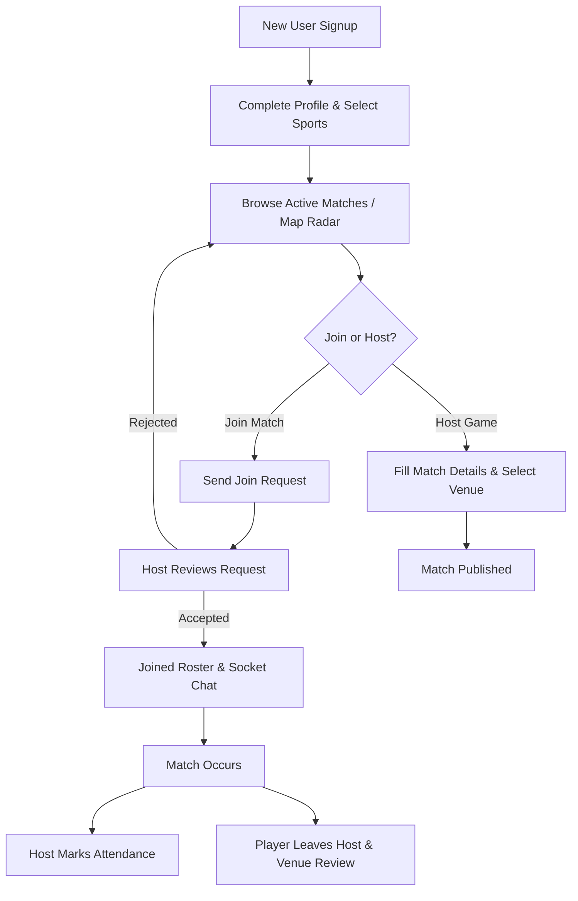
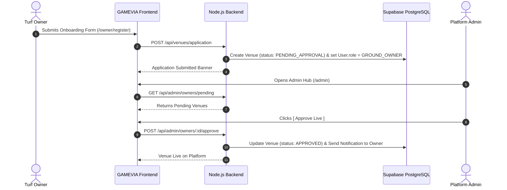

# GAMEVIA — Sports & E-Sports Community Platform

> **"Find a game. Find your people. Find a place to play."**

[](https://opensource.org/licenses/ISC)
[](https://react.dev/)
[](https://www.typescriptlang.org/)
[](https://vitejs.dev/)
[](https://nodejs.org/)
[](https://www.postgresql.org/)
[](https://www.prisma.io/)
[](https://socket.io/)
[](https://vercel.com)
[](https://render.com)

**GAMEVIA** is a full-stack local sports and e-sports community platform designed to eliminate the friction of organizing casual games, finding reliable co-players, and discovering verified local sports venues (box cricket turfs, football fields, badminton courts, swimming pools, pickleball courts, and e-sports lounges).

---

## Table of Contents

- [1. Overview](#1-overview)
- [2. Problem Statement](#2-problem-statement)
- [3. What Gamevia Does](#3-what-gamevia-does)
- [4. Key Features](#4-key-features)
  - [Players](#players)
  - [Match System](#match-system)
  - [E-Games](#e-games)
  - [Venues & Turf Owners](#venues--turf-owners)
  - [Administration](#administration)
- [5. User Roles & Permissions](#5-user-roles--permissions)
- [6. Complete User Flows](#6-complete-user-flows)
  - [New Player Journey](#new-player-journey)
  - [Joining a Match](#joining-a-match)
  - [Venue Owner Onboarding](#venue-owner-onboarding)
  - [Admin Moderation Workflow](#admin-moderation-workflow)
- [7. System Architecture](#7-system-architecture)
- [8. Technology Stack](#8-technology-stack)
- [9. Frontend Architecture](#9-frontend-architecture)
- [10. Backend Architecture](#10-backend-architecture)
- [11. Database Architecture & Models](#11-database-architecture--models)
- [12. Authentication & Authorization](#12-authentication--authorization)
- [13. Match Lifecycle & Concurrency](#13-match-lifecycle--concurrency)
- [14. Match Discovery & Geolocation](#14-match-discovery--geolocation)
- [15. Physical Sports vs E-Games](#15-physical-sports-vs-e-games)
- [16. Player Profiles & Reliability Score](#16-player-profiles--reliability-score)
- [17. Venue Owner Platform & Analytics](#17-venue-owner-platform--analytics)
- [18. Venue Approval Workflow](#18-venue-approval-workflow)
- [19. Venue & Host Ratings & Reviews](#19-venue--host-ratings--reviews)
- [20. Messaging & Message Requests](#20-messaging--message-requests)
- [21. Notifications](#21-notifications)
- [22. Fraud Reporting & Moderation](#22-fraud-reporting--moderation)
- [23. Admin Control Center](#23-admin-control-center)
- [24. Google Maps Navigation Redirects](#24-google-maps-navigation-redirects)
- [25. Media & Image Uploads](#25-media--image-uploads)
- [26. API Reference](#26-api-reference)
- [27. Environment Variables](#27-environment-variables)
- [28. Local Development Setup](#28-local-development-setup)
- [29. Database Setup & Seeding](#29-database-setup--seeding)
- [30. Running the Application](#30-running-the-application)
- [31. Automated Testing](#31-automated-testing)
- [32. Production Build & Deployment](#32-production-build--deployment)
- [33. Project Structure](#33-project-structure)
- [34. Security Considerations](#34-security-considerations)
- [35. Free-Tier & Scaling Philosophy](#35-free-tier--scaling-philosophy)
- [36. Design System & Visual Aesthetics](#36-design-system--visual-aesthetics)
- [37. Current Scope & Limitations](#37-current-scope--limitations)
- [38. Future Enhancements](#38-future-enhancements)
- [39. Author](#39-author)

---

## 1. Overview

**GAMEVIA** bridges the gap between casual sports enthusiasts and local sports infrastructure. While booking platforms treat ground reservations as isolated transactions, GAMEVIA focuses on **player participation and community building**:

- **For Players**: Discover physical matches or custom e-sports rooms nearby, request to join open slots, coordinate in real time via Socket.IO room chat, and build a verified attendance score.
- **For Turf & Venue Owners**: Onboard box cricket turfs, football fields, badminton courts, swimming pools, and e-sports lounges, track match bookings, receive community reviews, and access estimated revenue analytics.
- **For Platform Administrators**: Oversee owner applications, review user/venue fraud flags, moderate reviews, and ensure platform safety.

---

## 2. Problem Statement

Sports enthusiasts frequently encounter barriers when trying to play:
1. **Unfilled Slots**: A group of 6 players wants to play 6v6 box cricket but lacks 6 additional players.
2. **Unreliable Participants**: Players commit verbally but fail to show up, ruining matches.
3. **Discoverability**: Local turf owners struggle to gain visibility for non-peak slots.
4. **Safety & Fraud**: Fake match listings, ghost hosts, or inaccurate venue locations.

GAMEVIA addresses these issues by offering location-based match discovery, host-managed join requests, transaction-safe player slot reservations, an automated **Reliability Score** system, venue owner onboarding with admin verification, and integrated fraud reporting.

---

## 3. What Gamevia Does

- **Match Creation & Hosting**: Hosts set time, date, total slots, pricing per head, location, and tags for physical games or room codes for e-games.
- **Join Request Workflow**: Interested players send join requests; hosts approve or reject applicants to control roster quality.
- **Location Radar & Map**: Interactive Mapbox radar highlighting live user GPS coordinates in **Vibrant Green**, active matches in **Tangerine Orange**, and verified turf venues in **Cobalt Blue**.
- **Distance Calculation**: Exact Haversine distance badges (e.g. `📍 0.8 km away • Narayanguda`) relative to the user's location.
- **Post-Game Feedback**: Players rate host coordination and venue quality (turf condition, floodlights, parking, cleanliness).
- **Socket.IO Chat**: Instant real-time chat rooms for confirmed match participants.
- **Venue Owner Analytics**: Owners track total matches hosted, confirmed participants, and estimated match value (`pricePerHead × confirmed participants`).
- **Admin Governance**: Admin dashboard (`/admin`) for approving/rejecting owner applications, resolving fraud reports, and moderating reviews.

---

## 4. Key Features

### Players
- **Authentication**: Email/password registration via Supabase Auth + zero-verification instant demo sessions for testing.
- **Profiles**: Customizable display name, bio, avatar selection (`avatar_01` to `avatar_06`), physical sports interests, e-sports interests, and gaming IDs (Riot ID, Steam ID, Discord ID).
- **Player Reputation**: Visual statistics for attended games, missed games, hosted games, and calculated **GAMEVIA Reliability Score**.
- **Direct Messaging**: Request-gated 1-on-1 direct messaging with privacy toggle (`allowMessageRequests`).

### Match System
- **Physical & E-Game Modes**: Supports physical field sports and virtual gaming rooms.
- **Slot Capacity Management**: Real-time filled/total capacity bar with atomic SQL slot increments.
- **Host Controls**: Accept/reject join requests, cancel matches, mark post-game player attendance.
- **Google Maps Navigation**: One-click redirect (`https://www.google.com/maps/dir/?api=1&destination=LAT,LNG`) opening turn-by-turn directions in Google Maps.

### E-Games
- Dedicated support for virtual titles: **BGMI**, **Free Fire**, **Valorant**, **EA FC**, **COD Mobile**.
- E-game specific fields: `eGameName`, `eGameMode` (Squad, Duo, 5v5), `ePlatform` (Mobile, PC, Console), and custom `roomCode`.
- Physical distance calculations automatically bypassed for online games.

### Venues & Turf Owners
- **Owner Onboarding**: Form to submit venue name, category, hourly rate, address, locality, amenities, Mapbox pinpoint, and Cloudinary photos.
- **Status Lifecycle**: `PENDING_APPROVAL` → Admin review → `APPROVED` (Live) or `REJECTED` / `SUSPENDED`.
- **Owner Dashboard**: View business metrics, customer reviews, and upcoming matches hosted at the venue.

### Administration
- **Exclusive Access**: Protected `/admin` endpoint restricted to server-verified `ADMIN` accounts (`admin@gmail.com`).
- **Overview Dashboard**: Platform-wide metrics for total users, live venues, pending applications, active games, reports, and reviews.
- **Moderation Actions**: Approve/reject venues, suspend/reinstate ground owners, dismiss/act on fraud reports, delete inappropriate reviews.

---

## 5. User Roles & Permissions

| Role | Discovery & Booking | Create Matches | Owner Onboarding | Access Admin Hub |
| :--- | :---: | :---: | :---: | :---: |
| **USER** | ✅ | ✅ | ✅ (Can apply) | ❌ |
| **GROUND_OWNER** | ✅ | ✅ | ✅ (Manages venue) | ❌ |
| **POOL_OWNER** | ✅ | ❌ (Venue managed) | ✅ | ❌ |
| **ADMIN** | ✅ | ✅ | ✅ | ✅ (`/admin`) |

> **Security Note**: Role authorization is strictly enforced on the server in Express middleware (`requireAdmin`, `requireOwner`). Frontend UI hides/shows links based on authenticated user claims.

---

## 6. Complete User Flows


```mermaid
graph TD
  A[New User Signup] --> B[Complete Profile & Select Sports]
  B --> C[Browse Active Matches / Map Radar]
  C --> D{Join or Host?}
  D -->|Join Match| E[Send Join Request]
  E --> F[Host Reviews Request]
  F -->|Accepted| G[Joined Roster & Socket Chat]
  F -->|Rejected| C
  D -->|Host Game| H[Fill Match Details & Select Venue]
  H --> I[Match Published]
  G --> J[Match Occurs]
  J --> K[Host Marks Attendance]
  J --> L[Player Leaves Host & Venue Review]
```

### 1. Joining a Match
1. Player browses matches on `/dashboard` or Map Radar.
2. Clicks `View Game` → opens `/match/:id`.
3. Clicks `Request to Join Game` → creates `Request` with `status: PENDING`.
4. Host receives notification and reviews request on `/manage/:id`.
5. Upon host approval (`status: ACCEPTED`), `filledSlots` increments, participant enters Socket.IO chat, and match appears on user profile.
6. Post-match, host marks attendance (`ATTENDED` / `MISSED`), updating player's Reliability Score.

### 2. Owner Onboarding & Approval Flow

```mermaid
sequenceDiagram
  autonumber
  actor Owner as Turf Owner
  participant App as GAMEVIA Frontend
  participant API as Node.js Backend
  participant DB as Supabase PostgreSQL
  actor Admin as Platform Admin

  Owner->>App: Submits Onboarding Form (/owner/register)
  App->>API: POST /api/venues/application
  API->>DB: Create Venue (status: PENDING_APPROVAL) & set User.role = GROUND_OWNER
  API-->>App: Application Submitted Banner
  Admin->>App: Opens Admin Hub (/admin)
  App->>API: GET /api/admin/owners/pending
  API-->>App: Returns Pending Venues
  Admin->>App: Clicks [ Approve Live ]
  App->>API: POST /api/admin/owners/:id/approve
  API->>DB: Update Venue (status: APPROVED) & Send Notification to Owner
  API-->>App: Venue Live on Platform
```

---

## 7. System Architecture

```text
                                  +---------------------------------------+
                                  |         GAMEVIA Client App            |
                                  |   (React 19 + TypeScript + Vite)      |
                                  +-------------------+-------------------+
                                                      |
                                                      | HTTP REST & Socket.IO
                                                      v
                                  +-------------------+-------------------+
                                  |        Node.js / Express API          |
                                  |       (REST Endpoints + WebSockets)   |
                                  +---------+-----------------+-----------+
                                            |                 |
                         Prisma Client ORM  |                 | Supabase Auth JS
                                            v                 v
                                  +---------+-------+   +-----+-----------+
                                  | PostgreSQL DB   |   | Supabase Auth   |
                                  |  (Supabase DB)  |   |  Service        |
                                  +-----------------+   +-----------------+
```

---

## 8. Technology Stack

| Layer | Technology | Purpose |
| :--- | :--- | :--- |
| **Frontend** | React 19 | Component-driven User Interface |
| **Language** | TypeScript 5.4+ | End-to-end type safety |
| **Build Tool** | Vite 8 | Fast HMR & production bundling |
| **Styling** | Vanilla CSS + Tailwind CSS v4 | GAMEVIA Light Theme Design Token system |
| **Icons** | Lucide React | Modern visual UI iconography |
| **Backend Framework** | Node.js + Express 5 | REST API server & HTTP routing |
| **Database** | PostgreSQL | Relational storage hosted on Supabase |
| **ORM** | Prisma 5 | Schema migrations, types, & database client |
| **Authentication** | Supabase Auth | User identity & JWT verification |
| **Realtime WebSockets** | Socket.IO 4 | Instant match room messaging |
| **Maps & Radar** | Mapbox GL JS + React Map GL | Interactive location map & coordinate selection |
| **Media Storage** | Cloudinary API | Cloud storage for venue business photos |
| **Testing** | Vitest + Supertest | Unit testing for backend endpoints & components |
| **Hosting & Deployment** | Vercel (FE) + Render (BE) | Free-tier continuous integration & deployment |

---

## 9. Frontend Architecture

The frontend is structured as a single-page React application built with Vite and TypeScript:

- **State Management**: React `useState` / `useEffect` + Context API (`AuthProvider.tsx`).
- **Routing**: `react-router-dom` v7 with `ProtectedRoute` guards.
- **API Client**: Axios instance configured with base URL and authorization interceptors.
- **Design System**: Consumer light palette:
  - Primary: **Cobalt Blue (`#2457D6`)**
  - Accent: **Tangerine Orange (`#FF7A3D`)**
  - Base: **Warm White (`#F7F7F2`) / Pure White (`#FFFFFF`)**
  - Text: **Deep Slate (`#172033`)**

---

## 10. Backend Architecture

The backend is a Node.js Express server structured around decoupled controllers, routes, and middleware:

```text
backend/src/
├── index.ts               # Express server entry point & Socket.IO initialization
├── db.ts                  # Shared Prisma client singleton
├── middleware/
│   ├── auth.ts            # requireAuth, requireAdmin, requireOwner middleware
│   └── rateLimiter.ts     # Request rate limiting middleware
├── controllers/
│   ├── adminController.ts # Admin dashboard metrics & moderation logic
│   ├── venueController.ts # Owner onboarding, approved venues, reviews
│   ├── reportController.ts# User & venue fraud reporting
│   ├── matchController.ts # Match CRUD, filtering, & distance search
│   ├── userController.ts  # Profiles & direct message requests
│   └── attendanceController.ts # Attendance marking & Reliability Score recalculation
├── routes/                # Express route mounts (/api/admin, /api/venues, etc.)
└── utils/
    └── location.ts        # Haversine distance formula & Google Maps redirect generator
```

---

## 11. Database Architecture & Models

```text
User ─── (1:1) ─── Profile
  │
  ├─── (1:N) ─── Match (as Host)
  ├─── (1:N) ─── Request (Join Requests)
  ├─── (1:N) ─── Attendance
  ├─── (1:N) ─── Review (as Author / Reviewed Host)
  ├─── (1:N) ─── Message (in Chat)
  ├─── (1:N) ─── Notification
  ├─── (1:N) ─── Venue (as Venue Owner)
  ├─── (1:N) ─── VenueReview
  └─── (1:N) ─── Report (as Reporter)

Venue ─── (1:N) ─── Match
  │
  └─── (1:N) ─── VenueReview
```

### Core Schema Enums
- `Role`: `USER`, `GROUND_OWNER`, `POOL_OWNER`, `ADMIN`
- `VenueStatus`: `PENDING_APPROVAL`, `APPROVED`, `REJECTED`, `SUSPENDED`
- `MatchType`: `PHYSICAL`, `E_GAME`
- `MatchStatus`: `AVAILABLE`, `FILLED`, `COMPLETED`, `CANCELLED`
- `RequestStatus`: `PENDING`, `ACCEPTED`, `REJECTED`
- `AttendanceStatus`: `ATTENDED`, `MISSED`, `PENDING`
- `ReportTargetType`: `USER`, `OWNER`, `VENUE`, `MATCH`, `REVIEW`

---

## 12. Authentication & Authorization

Authentication is powered by **Supabase Auth**:

1. **Token Flow**: The client signs in via Supabase Auth and passes the `Authorization: Bearer <access_token>` header on API requests.
2. **Backend Middleware** (`backend/src/middleware/auth.ts`):
   - Decodes Supabase JWT token via `@supabase/supabase-js`.
   - Fetches the corresponding `User` record from PostgreSQL.
   - Rejects suspended users (`user.isSuspended === true`) with HTTP 403.
   - Automatically promotes `admin@gmail.com` to `ADMIN` role if not already set.
3. **Role Validation**:
   - `requireAdmin`: Verifies `req.user.role === 'ADMIN'`.
   - `requireOwner`: Verifies `req.user.role === 'GROUND_OWNER'` or `'ADMIN'`.

---

## 13. Match Lifecycle & Concurrency

```text
Match Created (AVAILABLE)
       │
       ├── Players request to join (Request: PENDING)
       ├── Host accepts requests (Request: ACCEPTED)
       │       └── filledSlots incremented atomically in SQL transaction
       │
       ├── filledSlots === totalSlots  ──> Match status becomes FILLED
       │
       ├── Host marks attendance post-game ──> Match status becomes COMPLETED
       │
       └── Host cancels match ──> Match status becomes CANCELLED
```

### Concurrency Protection
To prevent overbooking when multiple players request the final slot simultaneously:
- Slot updates use Prisma `$transaction` blocks.
- `filledSlots` increments are computed against the actual database count of accepted requests (`requests.filter(r => r.status === 'ACCEPTED').length`), ensuring `filledSlots` never exceeds `totalSlots`.

---

## 14. Match Discovery & Geolocation

Physical matches and turf venues are discovered using a two-tier location strategy:

1. **Latitude/Longitude Filtering**: DB models store `latitude` and `longitude` with PostgreSQL B-tree indexes (`@@index([latitude, longitude])`).
2. **Haversine Distance Calculation** (`backend/src/utils/location.ts`):
   $$\text{d} = 2 R \arcsin \left( \sqrt{\sin^2\left(\frac{\Delta \phi}{2}\right) + \cos(\phi_1) \cos(\phi_2) \sin^2\left(\frac{\Delta \lambda}{2}\right)} \right)$$
   Where $R = 6371\text{ km}$.
3. **Radius & Sorting**: Filters out entries beyond the selected radius (e.g. 2km, 5km, 10km, 25km) and sorts results from nearest to farthest.
4. **Fallback Handling**: If browser geolocation is denied, the system gracefully falls back to area search by locality (e.g., Narayanguda, Himayatnagar, Gachibowli).

---

## 15. Physical Sports vs E-Games

| Feature | Physical Sports | E-Games |
| :--- | :--- | :--- |
| **Location Requirement** | Mandatory street address & lat/lng | Bypassed (`isOnline = true`, `locationText = "Online / Custom Room"`) |
| **Distance Calculations** | Haversine distance badge displayed | Excluded from radius filtering |
| **Game Fields** | Venue category, ground surface | Title, `eGameName` (BGMI, Valorant), `eGameMode`, `roomCode` |
| **Reliability Score Impact** | Affects physical reliability score | Does not degrade physical attendance score |

---

## 16. Player Profiles & Reliability Score

Each player maintains a transparent **GAMEVIA Reliability Score** (0–100%) calculated upon every attendance update:

$$\text{Attendance Ratio} = \frac{\text{Attended Games}}{\text{Attended Games} + \text{Missed Games}}$$

$$\text{Reliability Score} = \min\left(100, \max\left(0, \text{Math.round}\left(\text{Attendance Ratio} \times 80 + \min(20, \text{Hosted Games} \times 5)\right)\right)\right)$$

- **New Players**: Default score is **100%**.
- **Attendance Impact**: Base attendance ratio accounts for up to 80 points.
- **Host Bonus**: Successfully hosting completed games adds +5 points per game (capped at +20 bonus points).

---

## 17. Venue Owner Platform & Analytics

Turf and facility owners register via `/owner/register`:

- **Business Details**: Venue name, category (Box Cricket, Football Turf, Swimming Pool, etc.), address, locality, hourly rate (`pricePerHour`), owner phone, amenities list.
- **Photos**: Up to 5 high-resolution venue photos uploaded directly to Cloudinary.
- **Business Analytics Dashboard** (`/owner/dashboard`):
  - **Status Badge**: `UNDER ADMIN REVIEW`, `LIVE ON GAMEVIA`, `SUSPENDED`.
  - **Matches Hosted**: Total games organized at the facility.
  - **Confirmed Participants**: Total players hosted.
  - **Estimated Match Value**: Calculated as $\sum (\text{pricePerHead} \times \text{confirmedParticipants})$.
  - **Average Rating**: Live star rating recalculated from customer reviews.

---

## 18. Venue Approval Workflow

1. Owner submits application → status set to `PENDING_APPROVAL`.
2. Admin logs into `/admin` → inspects application, images, and location map.
3. **If Approved**:
   - Status updated to `APPROVED`.
   - Owner's role updated to `GROUND_OWNER`.
   - In-app notification sent to owner.
   - Venue becomes publicly visible on dashboard & map radar.
4. **If Rejected**:
   - Status updated to `REJECTED` with admin rejection reason.
5. **If Suspended**:
   - Status updated to `SUSPENDED` (hidden from public discovery until reinstated).

---

## 19. Venue & Host Ratings & Reviews

- **Eligibility**: Players can leave feedback for matches they attended or after a game completes.
- **Dual Feedback**:
  1. **Host Review**: 1-to-5 star rating and comment regarding host punctuality and organization.
  2. **Venue Review**: 1-to-5 star rating and comment regarding turf condition, floodlights, parking, and cleanliness.
- **Duplicate Prevention**: Unique SQL constraint `@@unique([venueId, authorId, matchId])` prevents duplicate reviews for the same match.
- **Average Recalculation**: Venue `rating` and `reviewCount` automatically update upon review creation or deletion.

---

## 20. Messaging & Message Requests

To prevent unwanted spam while enabling match coordination:

1. **Message Request Model**: User A sends a `MessageRequest` to User B.
2. **Privacy Toggle**: Users can toggle `allowMessageRequests` off in their profile settings.
3. **Socket.IO Real-Time Chat**: Confirmed participants in a match enter a dedicated Socket.IO room (`matchId`) to exchange real-time messages.

---

## 21. Notifications

In-app notifications (`Notification` model) alert users when:
- A host approves or rejects their match join request.
- An admin approves or updates their venue application status.
- A user receives a new message request.

---

## 22. Fraud Reporting & Moderation

Users can flag suspicious content via the `[ Report Match ]` button on match details or venue profiles:

- **Report Targets**: `USER`, `OWNER`, `VENUE`, `MATCH`, `REVIEW`.
- **Reasons**: Fraud/Scam, Fake Venue, Harassment, No-Show Host, Spam.
- **Admin Actions**: Admin reviews flags on `/admin` and can `[ Dismiss ]` or `[ Suspend Target ]`.

---

## 23. Admin Control Center

Accessible exclusively at `/admin` for `ADMIN` role users:

```text
/admin
├── 📊 Overview Tab       (Platform aggregate metrics)
├── ⏳ Pending Tab        (Approve/Reject owner venue applications)
├── 🏟️ Ground Owners Tab  (Manage live venues, Suspend/Reinstate)
├── 🚩 Fraud Reports Tab  (Review user flags & take moderation action)
└── 💬 Review Moderation  (Inspect & delete inappropriate reviews)
```

---

## 24. Google Maps Navigation Redirects

Rather than embedding heavy turn-by-turn navigation SDKs, GAMEVIA generates standard Google Maps Universal Direction URLs:

```text
https://www.google.com/maps/dir/?api=1&destination=LAT,LNG
```

Clicking **`[ Open in Google Maps ]`** on match details or venue cards launches native Google Maps in a new browser tab with turn-by-turn navigation pre-filled to the venue coordinates.

---

## 25. Media & Image Uploads

Venue images are handled via Cloudinary:
- Uploads use Cloudinary's unsigned upload preset.
- Images are constrained to a maximum of 5 photos per venue.
- URLs are stored in the PostgreSQL database array column `images String[]`.

---

## 26. API Reference

### Authentication & User Profiles
| Method | Endpoint | Auth | Purpose |
| :--- | :--- | :---: | :--- |
| `GET` | `/api/users/profile` | Yes | Get authenticated user profile |
| `PUT` | `/api/users/profile` | Yes | Update profile bio, avatar, sports interests |
| `GET` | `/api/users/profile/:id` | Yes | Get public profile of another user |
| `POST` | `/api/users/message-requests` | Yes | Send a message request |
| `GET` | `/api/users/message-requests` | Yes | List incoming message requests |

### Matches & Attendance
| Method | Endpoint | Auth | Purpose |
| :--- | :--- | :---: | :--- |
| `GET` | `/api/matches` | No | Discover matches with type/sport/search filters |
| `POST` | `/api/matches` | Yes | Create physical or e-game match |
| `GET` | `/api/matches/:id` | No | Get match details & player roster |
| `POST` | `/api/matches/:id/requests` | Yes | Send request to join match |
| `POST` | `/api/users/attendance/:matchId` | Yes | Host marks player attendance |

### Venues & Turf Owners
| Method | Endpoint | Auth | Purpose |
| :--- | :--- | :---: | :--- |
| `GET` | `/api/venues` | No | Get approved venues with Haversine distance |
| `POST` | `/api/venues/application` | Yes | Submit venue owner application |
| `GET` | `/api/venues/my-venue` | Yes | Get owner's venue & business analytics |
| `POST` | `/api/venues/:id/reviews` | Yes | Submit venue star rating & review |

### Admin Moderation (`/api/admin`)
| Method | Endpoint | Auth | Purpose |
| :--- | :--- | :---: | :--- |
| `GET` | `/api/admin/overview` | Admin | Get platform aggregate statistics |
| `GET` | `/api/admin/owners/pending` | Admin | List pending venue applications |
| `POST` | `/api/admin/owners/:id/approve` | Admin | Approve venue listing live |
| `POST` | `/api/admin/owners/:id/reject` | Admin | Reject venue application |
| `POST` | `/api/admin/owners/:id/suspend` | Admin | Suspend venue listing |
| `GET` | `/api/admin/reports` | Admin | List submitted fraud reports |
| `POST` | `/api/admin/reports/:id/action` | Admin | Process report action |
| `DELETE` | `/api/admin/reviews/:id` | Admin | Delete inappropriate review |

---

## 27. Environment Variables

### Frontend Environment Variables (`frontend/.env`)
| Variable | Required | Purpose | Public? |
| :--- | :---: | :--- | :---: |
| `VITE_SUPABASE_URL` | Yes | Supabase Project URL | Yes |
| `VITE_SUPABASE_ANON_KEY` | Yes | Supabase Anonymous Key | Yes |
| `VITE_API_URL` | Yes | Backend API base URL (`http://localhost:5001/api`) | Yes |
| `VITE_MAPBOX_TOKEN` | Optional | Mapbox GL Access Token | Yes |
| `VITE_CLOUDINARY_CLOUD_NAME` | Optional | Cloudinary Cloud Name | Yes |
| `VITE_CLOUDINARY_UPLOAD_PRESET` | Optional | Cloudinary Unsigned Upload Preset | Yes |

### Backend Environment Variables (`backend/.env`)
| Variable | Required | Purpose | Secret? |
| :--- | :---: | :--- | :---: |
| `PORT` | Yes | Server Listening Port (Default `5001`) | No |
| `DATABASE_URL` | Yes | Supabase PostgreSQL Connection String (Transaction Pooler) | **Yes** |
| `DIRECT_URL` | Yes | Supabase Direct PostgreSQL Connection String (Migrations) | **Yes** |
| `SUPABASE_URL` | Yes | Supabase Project URL | No |
| `SUPABASE_SERVICE_ROLE_KEY` | Yes | Supabase Service Role Key (Admin Auth) | **Yes** |
| `CLIENT_URL` | Yes | Frontend Client Origin URL (`http://localhost:5173`) | No |

---

## 28. Local Development Setup

### Prerequisites
- Node.js 18+ & npm
- PostgreSQL database (or Supabase project)
- Mapbox access token (optional for maps)

### Step 1: Clone Repository
```bash
git clone https://github.com/sathvikreddy369/playgrid.git
cd playgrid
```

### Step 2: Install Backend Dependencies
```bash
cd backend
npm install
```

### Step 3: Install Frontend Dependencies
```bash
cd ../frontend
npm install
```

---

## 29. Database Setup & Seeding

1. Configure `backend/.env` with your PostgreSQL `DATABASE_URL` and `DIRECT_URL`.
2. Push database schema:
   ```bash
   cd backend
   npx prisma db push
   ```
3. Generate Prisma client:
   ```bash
   npx prisma generate
   ```
4. Seed demo data (admin account, Narayanguda/Himayatnagar venues, and matches):
   ```bash
   npm run seed
   ```

---

## 30. Running the Application

### Start Backend Development Server
```bash
cd backend
npm run dev
```
*Backend runs on `http://localhost:5001`*

### Start Frontend Development Server
```bash
cd frontend
npm run dev
```
*Frontend runs on `http://localhost:5173`*

---

## 31. Automated Testing

### Backend Unit & Integration Tests (Vitest)
```bash
cd backend
npm run test
```
*Executes 21 unit & integration tests covering user authentication, match creation, attendance reliability score calculation, E-sports filtering, message requests, and concurrency protection.*

### Frontend Component Tests (Vitest + React Testing Library)
```bash
cd frontend
npm run test
```
*Executes component tests covering NotificationBell and ImageUpload UI widgets.*

---

## 32. Production Build & Deployment

### Production Build Verification
```bash
# Build Backend
cd backend
npm run build

# Build Frontend
cd ../frontend
npm run build
```

### Deployment Strategy
- **Frontend**: Deployed on **Vercel** connected to the `frontend/` directory with build command `npm run build` and output `dist`.
- **Backend**: Deployed on **Render** (Web Service) running Node.js with start command `npm run start`.
- **Database**: Hosted on **Supabase PostgreSQL** using connection pooling.

---

## 33. Project Structure

```text
playgrid/
├── backend/
│   ├── prisma/
│   │   ├── schema.prisma   # PostgreSQL Prisma Schema
│   │   └── seed.ts         # Database Seeding Script
│   ├── src/
│   │   ├── __tests__/      # Backend Integration Tests
│   │   ├── controllers/    # Express Route Controllers
│   │   ├── middleware/     # Auth & Rate Limiter Middleware
│   │   ├── routes/         # REST API Routes
│   │   ├── utils/          # Location & Haversine Helpers
│   │   ├── db.ts           # Prisma Client Singleton
│   │   └── index.ts        # Express Server & Socket.IO Entry Point
│   ├── package.json
│   └── tsconfig.json
├── frontend/
│   ├── src/
│   │   ├── components/     # Reusable React UI Components
│   │   ├── pages/          # Page Views (Dashboard, Admin, MatchDetails, etc.)
│   │   ├── utils/          # Frontend Helpers & Google Maps Redirects
│   │   ├── api.ts          # Axios API Instance
│   │   ├── App.tsx         # Main Application & Router
│   │   └── main.tsx        # React DOM Entry Point
│   ├── index.html
│   ├── package.json
│   └── vite.config.ts
├── render.yaml             # Render Backend Deployment Spec
├── CHANGELOG.md
└── README.md
```

---

## 34. Security Considerations

- **Server-Side Authorization**: Every state-changing API endpoint verifies identity and roles on the backend independently of frontend state.
- **Prepared Statements**: All database operations use Prisma ORM parameterization, preventing SQL injection vulnerabilities.
- **JWT Verification**: Auth tokens are verified using Supabase Auth keys.
- **Rate Limiting**: `express-rate-limit` prevents brute-force attempts on API routes.
- **User Suspension Enforcement**: Suspended users are denied access immediately at the authentication middleware layer.

---

## 35. Free-Tier & Scaling Philosophy

GAMEVIA is designed as a personal portfolio project optimized to run efficiently on free-tier infrastructure (Vercel, Render, Supabase, Cloudinary, Mapbox):

- **No Expensive Infrastructure**: Uses lightweight PostgreSQL B-tree spatial indexing and in-memory Haversine calculations rather than complex GIS server clusters.
- **Client Debouncing**: Search inputs use 300ms debouncing to minimize backend database queries.
- **Pagination**: API endpoints return paginated responses (default 12 items per page) to prevent high memory usage.

---

## 36. Design System & Visual Aesthetics

- **Color Theme**: Cobalt Blue (`#2457D6`) + Tangerine Orange (`#FF7A3D`) + Warm White (`#F7F7F2`).
- **Typography**: Clean modern sans-serif hierarchy with bold uppercase headers and tracking.
- **Surface Elevation**: Light borders (`#E6E8EC`) with subtle shadows and backdrop blurs.
- **Mobile First**: Fully responsive layout featuring a dedicated mobile bottom navigation bar (`MobileNav.tsx`).

---

## 37. Current Scope & Limitations

- **Render Cold Starts**: Render free tier web services spin down after inactivity; initial request may take ~30 seconds to wake up.
- **Navigation Redirects**: Navigation relies on Google Maps URL redirects rather than in-app turn-by-turn navigation.
- **Payment Processing**: Match entry fees and turf hourly rates are displayed for estimation purposes; direct in-app payment gateway processing is outside the current scope.

---

## 38. Future Enhancements

- [ ] Razorpay / UPI payment gateway integration for advance turf booking deposits.
- [ ] Push Notifications via Web Push API for real-time join request alerts.
- [ ] Tournament Bracket Manager for local box cricket and e-sports knockout leagues.
- [ ] PostGIS spatial queries if scale demands multi-city geospatial indexing.

---

## 39. Author

**Sathvik Reddy**
- GitHub: [@sathvikreddy369](https://github.com/sathvikreddy369)
- Project Repository: [https://github.com/sathvikreddy369/playgrid](https://github.com/sathvikreddy369/playgrid)
