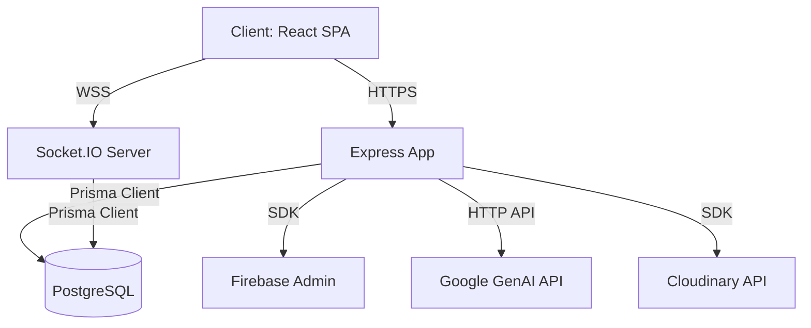

# 02. Architecture

## Architecture Diagram (Mermaid)

## Description
PlayGrid uses a decoupled Client-Server architecture:
1. **Frontend**: React Single Page Application (SPA) bundled via Vite. Styled with TailwindCSS and powered by Framer Motion. State management is handled through React Context APIs (for Auth and layout states) and TanStack React Query (for server-cache synchronizations).
2. **Backend**: Express.js server written in TypeScript. Intercepts incoming requests for rate-limiting, authentication verification via Firebase Admin SDK, and body validation using Zod.
3. **Database**: PostgreSQL database. Structured and queried through Prisma. Includes migrations and seed scripts.
4. **Real-time**: Socket.IO integration for messaging, typing states, read receipts, and live notifications.
5. **AI Systems**: Google GenAI integration (Gemini 2.5 Flash) for processing natural language search parsing, post/reply content safety checks, and venue reviews summarization.

---

*This document is part of PlayGrid V1 Technical Manual.*
