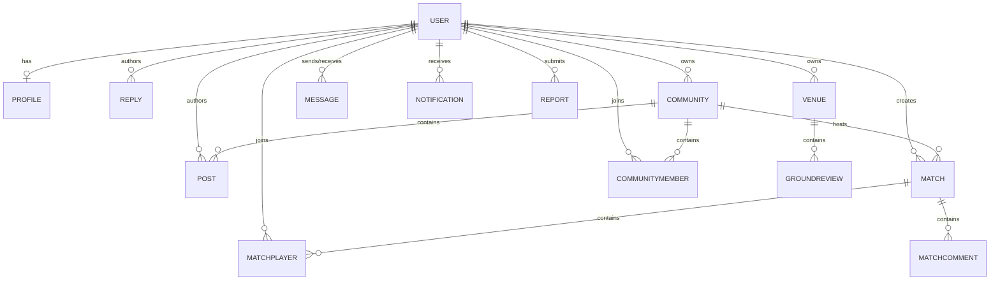

# 04. Database Schema

## Entity Relationship Model

## Schema Entities (Summary)
- **User**: Core entity. Syncs with Firebase UID. Holds reputation points (default 100).
- **Profile**: Extended metadata (bio, favorite sports, home coordinates for distance queries).
- **Match**: Details of scheduled activities, cost per person, and max participant caps.
- **MatchPlayer**: Maps users to matches with confirmation statuses (`PENDING`, `APPROVED`, `REJECTED`, `ATTENDED`).
- **Venue**: Venue entities. Status checks (`PENDING`, `VERIFIED`, `REJECTED`), amenities, contact phone, and AI summarization cache.
- **Post & Reply**: Community discussions supporting nested responses and likes.
- **Message**: DM store with read flags.
- **Notification**: Target redirect links, alert text, read states.

---

*This document is part of PlayGrid V1 Technical Manual.*
