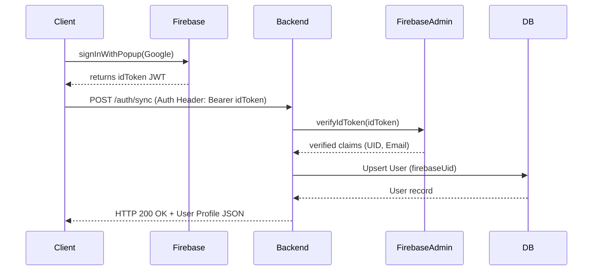

# 06. Authentication

## Mechanism
PlayGrid delegates identity assertion to **Firebase Authentication** on the client side. The backend relies on a custom authentication middleware (`requireAuth`) to parse, verify, and translate these assertions.

## Flow Diagram



## Local Development Bypass
If Firebase configurations are not fully initialized (`process.env.FIREBASE_PROJECT_ID` is missing) in development/test modes, the middleware decodes the JWT token claims manually (without calling the Google Firebase API) to allow friction-free testing:
```typescript
const payload = JSON.parse(Buffer.from(idToken.split('.')[1], 'base64').toString());
decodedToken = { uid: payload.user_id || payload.sub };
```
In production (`NODE_ENV === 'production'`), this bypass is disabled, and valid cryptographic verification is strictly enforced.

---

*This document is part of PlayGrid V1 Technical Manual.*
