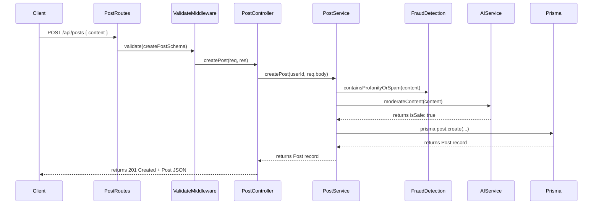

# 28. Data Flow

## Flow Diagram (Post Creation Example)

## Description
Data flows linearly through the system:
1. Client actions hit Express routes.
2. Payload structure is verified by the `validate` middleware using Zod schemas.
3. Controller extracts context (like `req.user.id` from `requireAuth`) and hands data off to services.
4. Services evaluate business rules, interact with database queries, and return raw data.
5. Controller shapes response formats and returns appropriate status codes.

---

*This document is part of PlayGrid V1 Technical Manual.*
