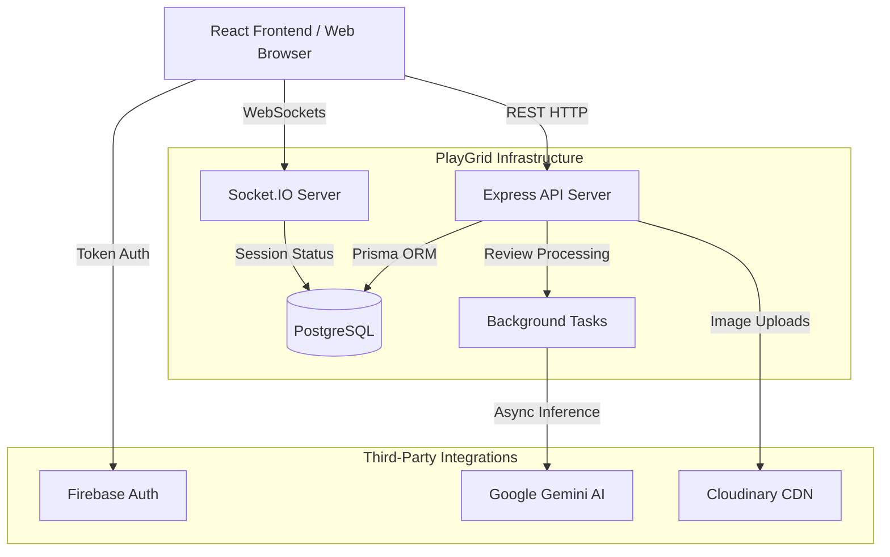
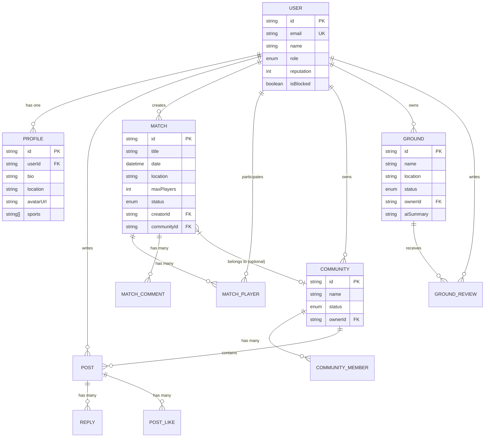

# PlayGrid Architecture & System Design

PlayGrid is built using a modern decoupled architecture. The frontend is a React Single Page Application (SPA), while the backend is an Express Node.js REST API powered by PostgreSQL. 

## High-Level Architecture

## Backend Design Patterns

### 1. Controller-Service Pattern
The backend isolates business logic from HTTP transport logic. 
- **Controllers** (`src/controllers/`) handle HTTP requests, request validation (via Zod), and JSON serialization.
- **Services** (`src/services/`) hold the core business logic and Prisma ORM interactions.

### 2. Observability & Logging
Every request passes through the `observabilityMiddleware` which attaches a unique `X-Request-ID`. A `StructuredLogger` outputs strictly JSON-formatted logs for automated ingestion by systems like Datadog or ELK.

### 3. Asynchronous AI Processing
Heavy tasks like AI review summarization using Gemini are handled outside the main request thread to prevent blocking the Node.js event loop.

## Database Entity-Relationship (ER) Diagram

Below is the database schema mapping the relationships between Users, Matches, Communities, and Grounds.

## Scalability Choices

1. **Pagination**: Core list endpoints implement `skip/take` pagination to limit payload sizes and query times.
2. **Indexing**: Spatial coordinates (`latitude`, `longitude`) and heavily filtered fields (`status`, `date`) are indexed in PostgreSQL.
3. **Caching Strategy**: The frontend leverages React Query to aggressively cache immutable data (like static profiles or completed matches) while keeping real-time data fresh.
