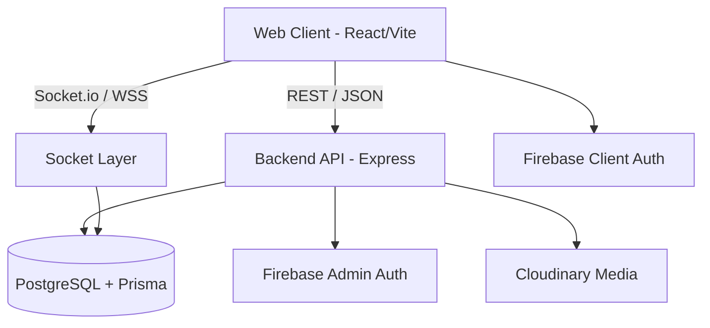

# Architecture Overview

PlayGrid follows a modern, decoupled monolithic architecture separated into a distinct Frontend (React/Vite) and Backend (Express/Node.js).

## High-Level Diagram

```mermaid
graph TD
    Client[Web Client - React/Vite] -->|REST / JSON| Express[Backend API - Express]
    Client -->|Socket.io / WSS| Sockets[Socket Layer]
    Express --> DB[(PostgreSQL + Prisma)]
    Sockets --> DB
    Express --> Auth[Firebase Admin Auth]
    Client --> Firebase[Firebase Client Auth]
    Express --> Cloudinary[Cloudinary Media]
```

## System Components

### Frontend (SPA)
Built using React and Vite, the frontend operates as a Single Page Application. It uses `react-router-dom` for navigation, `react-query` for API state and caching, and `socket.io-client` for real-time capabilities.

### Backend (REST API + Sockets)
The backend is a Node.js Express server structured in a classic Controller-Service-Repository pattern. It handles business logic, security, permissions, and communicates directly with PostgreSQL via Prisma. A concurrent Socket.io server handles real-time bidirectional communication.

### Database
PostgreSQL is used as the primary data store. The schema is highly relational, utilizing Prisma as the ORM to guarantee end-to-end type safety between the database and the backend services.

### Real-time Layer
The Socket.io layer allows real-time dispatch of notifications, direct messages, community group chats, and live updates to the activity feed. It uses rooms and direct user connections to route messages efficiently.
